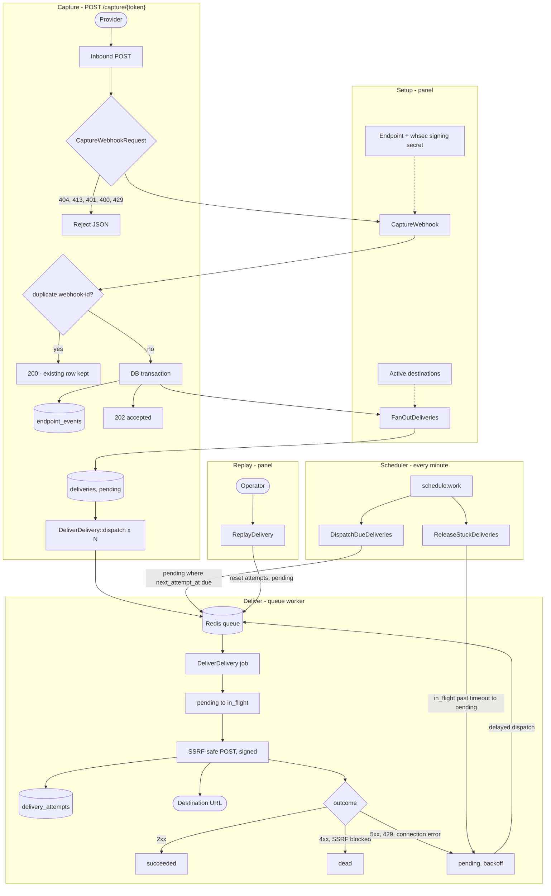

# Architecture

## Overview

Code is grouped by domain (`Domain/`) and entry-point adapter (`Interfaces/`). Domains organize business logic by concept; Interfaces organize it by caller - inbound HTTP, panel, console, and a future API - so domain code never depends on a specific transport. Framework glue stays in `app/`.

```
Domain/Endpoint/Actions     CaptureWebhook, StoreEndpoint, RotateEndpointSigningSecret
Domain/Endpoint/Models      Endpoint, EndpointEvent, EndpointSigningSecret
Domain/Endpoint/Policies    EndpointPolicy
Domain/Webhook/Utility      WebhookSecret, WebhookSignature
Domain/Delivery/Actions     FanOutDeliveries, DispatchDueDeliveries, ReleaseStuckDeliveries,
                            ReplayDelivery, StoreDestination, UpdateDestination, DeleteDestination
Domain/Delivery/Jobs        DeliverDelivery
Domain/Delivery/Models      Destination, DestinationSigningSecret, Delivery, DeliveryAttempt
Domain/User/Models          User

Interfaces/Inbound          POST /capture/{captureToken}
Interfaces/Console          hookline:dispatch-due-deliveries, hookline:release-stuck-deliveries
Interfaces/Panel            session UI (Livewire 4), Fortify CreateNewUser
```

Domain code never imports `Interfaces`. HTTP adapters map requests to DTOs (`Data/`) and call actions.

`Domain/Webhook` holds Standard Webhooks signing and verification for both capture and delivery - neither Endpoint nor Delivery owns it.

## Runtime flow

Setup (panel): create an **endpoint** (capture token + signing secret) and one or more **destinations** per endpoint. Runtime path:



## Capture

`CaptureWebhook` persists the event, calls `FanOutDeliveries` in the same transaction, then dispatches delivery jobs after commit.

`POST /capture/{captureToken}` is CSRF-exempt and unauthenticated; the token in the URL identifies the endpoint, and Standard Webhooks HMAC verifies the payload. `CaptureWebhookRequest` runs the gates in a deliberate order:

- 404 - token missing or endpoint inactive
- 413 - body over the configured cap (checked **before** HMAC, so oversized bodies are never hashed)
- 401 - Standard Webhooks HMAC / timestamp / missing or malformed `webhook-id`
- 400 - `webhook-id` longer than 255 chars (after HMAC, so unsigned callers still get 401)
- 429 - `throttle:capture`, per **token**, with `Retry-After`

The rate limiter is keyed per token, not per IP: providers like Stripe and GitHub share egress IPs, so IP-keyed limits would let one user exhaust another's budget.

Capture implements [Standard Webhooks](https://www.standardwebhooks.com/) v1: signed content is `id.timestamp.body`, signature is `v1,` + base64 HMAC-SHA256 over the decoded `whsec_` secret. `webhook-id` is also the deduplication key. Verification accepts any unexpired secret, which is what makes rotation zero-downtime.

**Insert-first idempotency.** Duplicates are handled by a unique `(endpoint_id, deduplication_key)` constraint, not a read-then-write check, so there is no race window and no extra query on the happy path. The unique violation is caught and returned as `200` (first capture is `202`). The stored payload is never overwritten if the same id arrives with a different body.

`payload` is stored as the exact bytes that were hashed;

## Delivery

**Transactional fan-out.** Fan-out happens inside the capture transaction: `FanOutDeliveries` creates one `pending` delivery row per active destination, so the event and its deliveries commit together. Jobs are dispatched after commit, so a worker can never pick up a row whose transaction might still roll back.

**Atomic claim.** `DeliverDelivery` claims its row with a single conditional `UPDATE` (`pending` and due to `in_flight`, attempt counter incremented in the same statement). If the update affects zero rows, another worker owns it or it is not due, and the job exits. Concurrent workers are safe without explicit locks.

Every send records a `delivery_attempts` row (request headers, response status, response snippet, duration, error). Outcomes: 2xx succeeds; 5xx, 429, 408, and connection errors retry with exponential backoff plus jitter; other 4xx and SSRF-blocked URLs go straight to `dead`. Exhausting the destination's `max_attempts` also marks the delivery `dead`, and the job's `failed()` hook dead-letters on unexpected exceptions so a row cannot strand in `in_flight`.

Two scheduled commands back the queue up, every minute: `DispatchDueDeliveries` re-dispatches due `pending` rows (safety net for lost delayed jobs) and `ReleaseStuckDeliveries` returns `in_flight` rows past the lock timeout to `pending`.

**Standard Webhooks on both sides.** Outbound requests are signed with the same scheme using the destination's own secrets. The delivery id is the outbound `webhook-id`, so retries of one delivery are idempotent at the receiver. Destination-configured custom headers are merged in a way that can never override the signature headers.

**Guarded egress.** All outbound POSTs go through an SSRF guard (`cboxdk/laravel-ssrf`); blocked URLs are recorded and dead-lettered, not retried. Each attempt records status, duration, and a response snippet for the panel.

Replay (from the panel) resets a `dead` or `succeeded` delivery to `pending` with zero attempts and dispatches immediately; `pending`/`in_flight` rows cannot be replayed.

## Panel

TALL stack: Livewire 4 class components, Alpine, Tailwind v4. Livewire classes live in `Interfaces/Panel/Livewire`, views in `resources/views/panel`. Full-page components are the screens: forms are Livewire Form Objects validated on submit, and persistence goes through a Domain action so the component stays a screen.

Auth is headless Fortify, registration and login only. Panel routes sit under `/user-panel` behind the `auth` group; guest/authenticated redirects are configured once in `bootstrap/app.php`.

Signing secrets live in their own tables (`endpoint_signing_secrets`, `destination_signing_secrets`), not as a column: the current key is the row with `expires_at` null, and rotation gives the old key a grace expiry instead of deleting it.


## Conventions

Route names are backed enums in `app/Routing/WebRoute` (`->name(WebRoute::Foo)`, `route(WebRoute::Foo)`). Paths stay strings in the route files.

Migrations have no `down()` (a custom stub removes it). Rolling back a table that holds captured webhooks would destroy data, so rollbacks are deliberately unsupported: schema changes are new `up()` migrations.

Structured ops logging goes to the `hookline` log channel (daily rotation). Delivery and capture tuning live in `config/hookline.php`.
