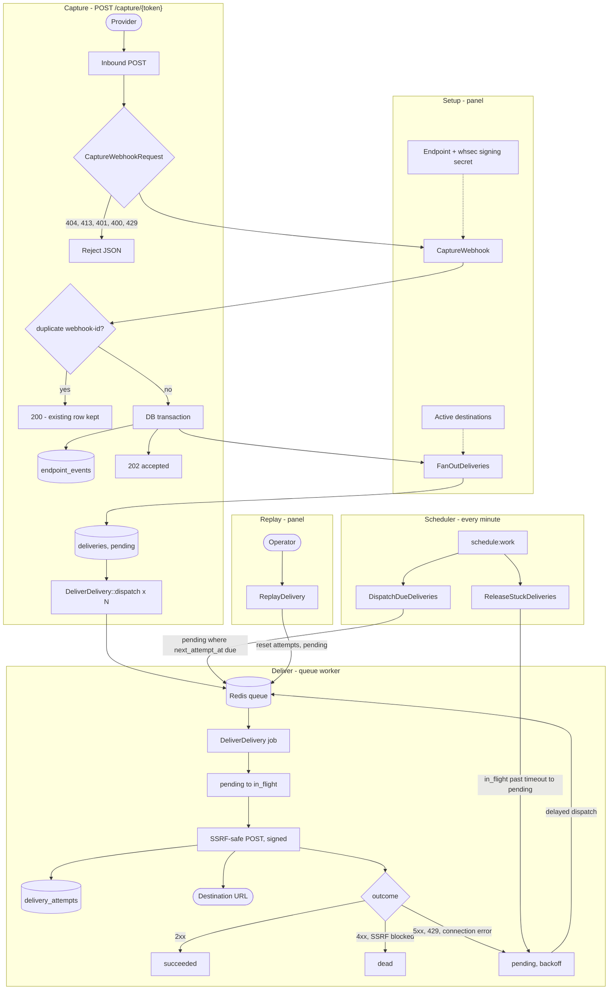

# Hookline

Durable webhook relay built with Laravel. Inbound webhooks are verified, stored, and forwarded to your destinations with retries, exponential backoff, dead-lettering, and manual replay.

Portfolio demo, not a hosted product. Shows how to run capture, fan-out, and delivery as separate concerns with a small operator panel.

## What it does

| Area | Behavior |
| --- | --- |
| **Capture** | `POST /capture/{token}` - [Standard Webhooks](https://www.standardwebhooks.com/) v1 HMAC, per-token rate limit, body size cap |
| **Idempotency** | `webhook-id` is the deduplication key; duplicate returns `200`, first capture returns `202` |
| **Fan-out** | One stored event creates one delivery row per active destination |
| **Delivery** | Queue worker POSTs the original payload; signs outbound requests the same way |
| **Retries** | Exponential backoff (configurable cap); scheduler dispatches due rows every minute |
| **Dead letter** | Max attempts exhausted, terminal state; replay from the panel |
| **Safety** | SSRF guard on destination URLs; stuck in-flight deliveries released on a schedule |
| **Panel** | Register, manage endpoints and destinations, inspect events, attempts, and replay |

Structured ops logging goes to the `hookline` log channel (daily rotation).

## Stack

| Layer | Choice |
| --- | --- |
| Runtime | PHP 8.5, Laravel 13 |
| UI | Livewire 4, Alpine, Tailwind v4, Fortify (register/login) |
| Data | PostgreSQL 16 |
| Queue / cache / sessions | Redis 7 |
| HTTP hardening | `cboxdk/laravel-ssrf` on outbound delivery |
| Local dev | Docker Compose (app, nginx, worker, scheduler, postgres, redis) |
| Quality | PHPUnit, PHP CS Fixer, Larastan; CI on push/PR |

Domain logic lives under `Domain/`; HTTP and panel adapters under `Interfaces/`. No Filament; the panel is a handful of Livewire screens.

## Run locally

**Requirements:** Docker Desktop (Compose v2).

```bash
cp -n .env.docker.example .env.docker.local   # first time only
docker compose up --build
```

Wait until the stack is up, then from your machine (in the project directory) seed inside the **app** container:

```bash
docker compose exec app php artisan db:seed
```

On first start the `app`, `worker`, and `scheduler` containers run setup automatically: `composer install` (if `vendor/` is missing), `APP_KEY` generation (if empty), and `php artisan migrate`. The one-shot `node` service runs `npm ci && npm run build` before nginx starts, so Node on the host is optional.

The seed command above runs in Docker, not on the host PHP install. It loads the demo user `user@example.com` / `password123`. After `docker compose down -v`, run `docker compose up` then seed again the same way.

| Service | URL / access |
| --- | --- |
| App | http://localhost:8080 |
| Health | http://localhost:8080/up |
| Postgres | `localhost:5434` - user/pass/db: `hookline` / `secret` / `hookline` |
| Redis | `localhost:6379` |
| Worker | `docker compose logs -f worker` |
| Scheduler | `docker compose logs -f scheduler` |

Stop: `docker compose down`. Wipe DB volume: `docker compose down -v`.

Tailwind iteration without rebuilding the stack: `npm run build` on the host.

## Flow

Setup (panel): create an **endpoint** (capture token + signing secret) and one or more **destinations** per endpoint. Runtime path:



Capture: gates run before domain logic; idempotency is `(endpoint_id, webhook-id)` so duplicates never fan out again. Deliver: each job claims one row, records an attempt, then succeeds, dies, or schedules retry (capped by destination `max_attempts`). Scheduler: dispatches any due pending rows (backup if a delayed job was missed) and releases rows stuck in `in_flight`.

## Demo walkthrough

1. Log in at http://localhost:8080/login with `user@example.com` / `password123` (from the Docker seed step above).
2. **Endpoints**, then **New endpoint**. Copy the capture token and signing secret from the show page.
3. Add a **destination** URL (e.g. [webhook.site](https://webhook.site) or a local listener).
4. Send a signed capture request. The panel show page includes a curl recipe; signing follows Standard Webhooks (`webhook-id`, `webhook-timestamp`, `webhook-signature` over `id.timestamp.body`). Official [client libraries](https://github.com/standard-webhooks/standard-webhooks) work for generating signatures.
5. Open **Events** to see the payload, delivery status, attempt log, and **Replay** on failed or dead deliveries.

First capture returns `202` with `{ "deduplication_key": "..." }`. Sending the same `webhook-id` again returns `200` without a new row.

## Tests and static analysis

On the host (Postgres + Redis running, or use CI):

```bash
composer test       # php artisan test (115 tests)
composer cs-check   # PHP CS Fixer dry-run
composer analyse    # PHPStan / Larastan
composer cs         # apply fixes
```

GitHub Actions runs the same suite on every push and pull request to `main`.

## Configuration

Delivery and capture tuning live in `config/hookline.php` (timeouts, backoff, rate limits, header allowlist). Hookline-specific log level and retention: `HOOKLINE_LOG_LEVEL`, `HOOKLINE_LOG_DAYS` in `.env`.
